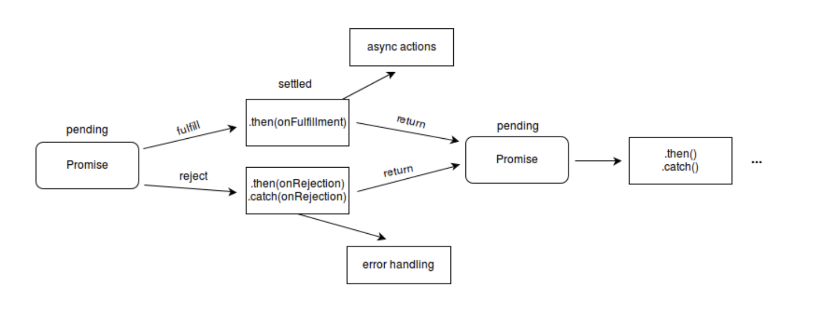

### 背景

&ensp;&ensp;&ensp;&ensp;&ensp;&ensp;&ensp;由于 JS 是单线程执行的，这就导致我们有些处理不得不使用异步执行的方式，比如请求数据啦，浏览器的一些方法啦等等。这就会导致一种场景存在，如果我们接下来的逻辑需要依赖异步执行后的结果怎么办？在过去，我们通常会用回调函数的方法来解决，就像下面这个例子
```js
request.onreadystatechange = function () {
    if (request.readyState === 4) {
        if (request.status === 200) {
            return success(request.responseText);
        } else {
            return fail(request.status);
        }
    }
}
```
&ensp;&ensp;&ensp;&ensp;&ensp;&ensp;&ensp;假如我们有多个请求都是依赖关系，那么就会导致一个回调函数内嵌套另一个回调函数，这样的代码看起来真的不是很好理解，也不利于后期代码的维护😖。
```js
// 类似这样，回调地狱，想想都可怕
ajax(url, () => {
    // 处理逻辑
    ajax(url1, () => {
        // 处理逻辑
        ajax(url2, () => {
            // 处理逻辑
        })
    })
})
```
&ensp;&ensp;&ensp;&ensp;&ensp;&ensp;&ensp;为了解决这个问题，Promise 就诞生了👏🏻👏🏻👏🏻，它是 ES6 中的语法，有了它我们就再也不用写这种恶心的回调地狱式代码。

### 初识Promise

&ensp;&ensp;&ensp;&ensp;&ensp;&ensp;&ensp;promise 翻译成中文是允诺，许诺的意思，我们可以理解为允诺在未来的某一个时刻会有一个确切的答复，并且这个允诺有三种状态，分别是：
- 等待中（pending）
- 完成了（resolved）
- 拒绝了（rejected）

一旦从等待状态转变为其它状态就不能再改变了。
```js
new Promise((resolve, reject) => {
  resolve('success')
  reject('fail') // 无效，已经变成 resolved 状态
})
```
Promise 构造函数内部的代码是立即执行的。
```js
new Promise((resolve) => {
  console.log('start')
  resolve('success')
})
console.log('end')

// start  end
```
Promise 实现了链式调用，每次调用 then 之后都会返回一个全新的 Promise，在 then 中如果使用了 return , return 中的值就会被 Promise.resolve() 包裹。
```js
new Promise((resolve) => {
  resolve('success')
}).then(res => {
  console.log(res)
  return '111'
}).then(res => {
  console.log(res)
})
// success    111
```
下面让我们来看看 Promise 如何解决回调地狱的问题吧。
```js
ajax(url)
  .then(res => {
      console.log(res)
      return ajax(url1)
  }).then(res => {
      console.log(res)
      return ajax(url2)
  }).then(res => console.log(res))
```
&ensp;&ensp;&ensp;&ensp;&ensp;&ensp;&ensp; 现在，你是否对 Promise 有一个大体的了解了呢，Promise 还有其它一些好用的 API，在这里我就不一一的详述啦，大家可以去看一下 MDN 官方的[文档](https://developer.mozilla.org/zh-CN/docs/Web/JavaScript/Reference/Global_Objects/Promise)，或者也可以看一下[廖雪峰的博客](https://www.liaoxuefeng.com/wiki/1022910821149312/1023024413276544)进行深入的了解。最后附上一张官方的图片，这张图将 Promise 解释的淋漓尽致。


### 进阶Promise
&ensp;&ensp;&ensp;&ensp;&ensp;&ensp;&ensp;当然，有追求的我们怎能单单的仅限于如何使用的层面呢🙄，接下来我们就要大展身手实现一个盗版的 Promise😏。
```js
const promise = new Promise((resolve, reject) => {
  reolve('success')
})
promise.then((res)=>{
  console.log(res)
},(err)=> {
  console.log(err)
})
```
上面的这段代码是我们正常的一个 promise 调用。
- 我们先创建了一个 Promise 实例。

- 给这个实例传进了一个函数数据类型的参数，这个函数参数是同步的，会直接运行，并且这个函数也接收了两个函数作为参数，分别代表 成功时候执行的回调 和 失败的时候执行的回调。

- 我们在构造函数中执行了这个成功的回调，并且传进了一个字符串作为参数

- 之后呢我们调用了 then，这个 then 方法接收了两个函数数据类型的参数，一个代表成功的回调，一个代表失败的回调，我们会根据调用了 resolve 还是 reject 来执行对应的回调。

- 在这里呢，我们执行了 resolve 回调，并传进了一个参数，我们将这个参数成功的打印出来啦。

- 结束。。。

到现在我们一步步分析完了，废话不多说，我们来一步步的实现吧💪🏻。

首先我们来创建一个 Mypromise 构造函数
```js
class Mypromise{
  constructor(){}
}
```
哈哈，创建好啦，没错，就是这么简单。
现在我们按照步骤，应该给这个构造函数传参，还是一个函数数据类型的参数，并且要直接运行。
```js
class Mypromise{
  constructor(excution){
    excution(resolve, reject)
  }
}
```
此时，我们发现这里的 resolve 和 reject 这两个函数参数并没有定义，所以我们要定义一下，并且还要定义三种状态的常量，初始化的状态为pending。
```js
const PENDING = 'pending'
const RESOLVE = 'resolve'
const REJECT = 'reject'
class Mypromise{
  status = PENDING
  result = undefined
  reason = undefined
  constructor(excution){
    const resolve = function(result){
      if(this.status = PENDING){
        this.status = RESOLVE
        this.result = result
      }
    }
    const reject = function(reason){
      if(this.status = PENDING){
        this.status = REJECT
        this.reason = reason
      }
    }
    excution(resolve, reject)
  }
}
```
在这一步我们还顺便把 成功 和 失败 的回调函数传参给实现了，相当于```result('success')```。因为 Promise 只有在状态为 pending 时才会改变状态，执行 resolve 和 reject 回调时我们的状态会改变，并且将参数存起来。

之后我们就要开始实现 then 函数啦。
```js
const PENDING = 'pending'
const RESOLVE = 'resolve'
const REJECT = 'reject'
class Mypromise{
  status = PENDING
  result = undefined
  reason = undefined
  constructor(excution){
    const resolve = (result) => {
      if(this.status === PENDING){
        this.status = RESOLVE
        this.result = result
      }
    }
    const reject = (reason) => {
      if(this.status === PENDING){
        this.status = REJECT
        this.reason = reason
      }
    }
    excution(resolve, reject)
  }
  then(onResolved, onRejected){
    if(this.status === RESOLVE){
      onResolved(this.result)
    }
    if(this.status === REJECT){
      onRejected(this.reason)
    }
  }
}
```
现在，让我们来试一下我们初见雏形的 promise 吧
```js
const promise = new Mypromise((resolve, reject) => {
    resolve('success')
})
promise.then(res => {
    console.log(res)
}, err => {})

// success
```
没问题，到现在为止，我么已经实现了一个基本的 promise 啦，哈哈哈，激动不😎，来，我们继续发现问题，解决问题。

我们看一下这个例子
```js
const promise = new Promise((resolve, reject) => {
  resolve('success')
})
promise.then(res => {
  console.log(res)
})
console.log('end')
// end success
```
```js
const promise = new Mypromise((resolve, reject) => {
  resolve('success')
})
promise.then(res => {
  console.log(res)
})
console.log('end')
// success end
```
细心的同学会发现，我们盗版 promise 得到结果的顺序和正版的结果顺序不太一样诶，让我们来分析一下。

看过文档的同学应该已经知道了，因为then方法是异步执行的，而我们现在实现的是同步的，所以会从上到下正常输出，那么我们来解决这个问题吧。

```js
const PENDING = 'pending'
const RESOLVE = 'resolve'
const REJECT = 'reject'
class Mypromise{
  status = PENDING
  result = undefined
  reason = undefined
  constructor(excution){
    const resolve = (result) => {
      if(this.status === PENDING){
        this.status = RESOLVE
        this.result = result
      }
    }
    const reject = (reason) => {
      if(this.status === PENDING){
        this.status = REJECT
        this.reason = reason
      }
    }
    excution(resolve, reject)
  }
  then(onResolved, onRejected){
    if(this.status === RESOLVE){
      setTimeout(() => {
        onResolved(this.result)
      }, 0)
    }
    if(this.status === REJECT){
      setTimeout(() => {
        onRejected(this.reason)
      }, 0)
    }
  }
}
```
我们用 setTimeout 将其包裹一下，这不就变成异步了么，来，再让我们试试
```js
const promise = new Mypromise((resolve, reject) => {
  resolve('success')
})
promise.then(res => {
  console.log(res)
})
console.log('end')
// end  success
```
OK! No problem，我们解决了这个问题。

开始切换下一个场景

```js
const promise = new Mypromise((resolve, reject) => {
  setTimeout(() => {
    resolve('success')
  },1000)
})
promise.then(res => {
  cosnole.log(res)
})
```
嗯？纳尼，怎么什么都没有输出呀，不是应该在1s之后输出 success 么，和我们想的不一样，好吧，让我们来康康我们实现的代码，分析一下。。。。

我们发现，在我们执行 then 方法时，此时的状态还是 pending，因为在我们创建实例的时候写了一个异步的方法，所以在没有执行这个方法前，状态都不会改变，一直是pending，而我们实现的 then 方法并没有判断状态为 pending 时的处理逻辑，所以什么都不会打印出来。

那我们整理一下思路，这是我们可能需要一个订阅者模式，在状态改变时，我们再判断执行哪个回调。
```js
const PENDING = 'pending'
const RESOLVE = 'resolve'
const REJECT = 'reject'
class Mypromise {
  status = PENDING
  result = undefined
  reason = undefined
  onResolvedArr = []
  onRejectedArr = []
  constructor(excutor){
    const resolve = (result) => {
      if(this.status === PENDING){
        this.status = RESOLVE
        this.result = result
        this.onResolvedArr.map(fn => fn())
        this.onRejectedArr.map(fn => fn())
      }
    }
    const reject = (reason) => {
      if(this.status === REJECT){
        this.status = REJECT
        this.reason = reason
      }
    }
    excutor(resolve, reject)
  }
  then(onResolved, onRejected){
    if(this.status === RESOLVE){
      setTimeout(() => {
        onResolved(this.result)
      }, 0)
    }
    if(this.status === REJECT){
      setTimeout(() => {
        onRejected(this.reason)
      }, 0)
    }
    if(this.status === PENDING){
      this.onResolvedArr.push(() => {
        onResolved(this.result)
      })
      this.onRejectedArr.push(() => {
        onRejected(this.reason)
      })
    }
  }
}
```
