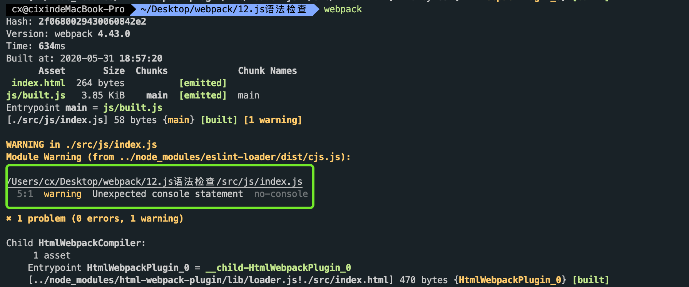

### eslint检查js

&ensp;&ensp;&ensp;&ensp;&ensp;&ensp;&ensp;如果我们好多人开发一个项目，每个人有自己一套代码规范，这样会造成代码混乱，不宜维护。而 eslint 可以解决这个问题，让开发者使用同一套代码规范。

webpack.config.js
```js
const { resolve } = require('path')
const HtmlWebpackPlugin = require('html-webpack-plugin')

module.exports = {
    entry: './src/js/index.js',
    output: {
        filename: 'js/built.js',
        path: resolve(__dirname, 'build')
    },
    module: {
        rules: [
            /*
                语法检查：eslint-loader eslint
                注意：只检查自己写的源代码，第三方的库是不用检查的。
                设置检查规则：
                    package.json中eslintConfig中设置
                        "eslintConfig":{
                            "extends": "airbnb-base"
                        }

                    https://github.com/airbnb/javascript
                    airbnb   -->  eslint-config-airbnb-base eslint eslint-plugin-import
            */
           {
               test: /\.js$/,
               exclude: /node_modules/,
               loader: 'eslint-loader',
               options: {
                   // 自动修复eslint的错误
                   fix: true
               }
           }
        ]
    },
    plugins: [
        new HtmlWebpackPlugin({
            template: './src/index.html'
        })
    ],
    mode: 'development'
}
```
需要 ```npm i eslint-loader eslint eslint-config-airbnb-base eslint-plugin-import```

package.json
```json
{
  "name": "webpack_code",
  "version": "1.0.0",
  "description": "",
  "main": "index.js",
  "scripts": {
    "test": "echo \"Error: no test specified\" && exit 1"
  },
  "author": "",
  "license": "ISC",
  "devDependencies": {
    "css-loader": "^3.5.3",
    "eslint": "^7.1.0",
    "eslint-config-airbnb-base": "^14.1.0",
    "eslint-loader": "^4.0.2",
    "eslint-plugin-import": "^2.20.2",
    "file-loader": "^6.0.0",
    "html-loader": "^1.1.0",
    "html-webpack-plugin": "^4.3.0",
    "less": "^3.11.1",
    "less-loader": "^6.1.0",
    "mini-css-extract-plugin": "^0.9.0",
    "optimize-css-assets-webpack-plugin": "^5.0.3",
    "postcss-loader": "^3.0.0",
    "postcss-preset-env": "^6.7.0",
    "style-loader": "^1.2.1",
    "url-loader": "^4.1.0",
    "webpack": "^4.43.0",
    "webpack-cli": "^3.3.11",
    "webpack-dev-server": "^3.11.0"
  },
  "browserslist": {
    "development": [
      "last 1 chrome version",
      "last 1 firefox version",
      "last 1 safari version"
    ],
    "production": [
      ">0.2%",
      "not dead",
      "not op_mini all"
    ]
  },
  "eslintConfig":{
    "extends": "airbnb-base"
  }
}
```
接下来我们可以试验一下，在 js 中写一些不规范的代码

index.js
```js
function add(a, b){
  return a+b;
}
console.log(add(2,3))
```
之后运行webpack，我们再来看一下 index.js 文件

```js
function add(a, b) {
  return a + b;
}
console.log(add(2, 3));
```
所有的代码都规范了，但是，在控制台有一个警告，建议我们不要在这里写 console.log


我们再来修改一下这个 index.js 文件吧

```js
function add(a, b) {
  return a + b;
}

// 下一行eslint所有规则都失效（下一行不进行eslint检查）
// eslint-disable-next-line
console.log(add(2, 3));
```

现在再运行 webpack 就不会有任何警告了

### babel处理js兼容性

&ensp;&ensp;&ensp;&ensp;&ensp;&ensp;&ensp;当我们使用 ES6 语法来写代码时，我们在谷歌浏览器打开完全没有问题，但是使用IE打开就会报错，比如箭头函数，在IE下是不识别的，这时我们就需要用到 babel 了，来将 ES6 甚至更高级的语法转换成浏览器识别的语法。我们需要下载 ```babel-loader``` ```@babel/core``` ```@babel/preset-env```

&ensp;&ensp;&ensp;&ensp;&ensp;&ensp;&ensp;在 webpack 中，按照以上的方法处理后，确实 IE 能识别像箭头函数这样的语法了，但是像更高级的语法 promise 却还是无法识别，这时我们需要做全部兼容性处理，用到 ```@babel/polyfill``` ，下载完成后，只需在代码中用 ```import '@babel/polyfill'```引入即可，我们再打开浏览器看一下，确实可以识别了 promise。

&ensp;&ensp;&ensp;&ensp;&ensp;&ensp;&ensp;虽然现在所有的语法都识别了，但现在还是有一个弊端，之前我们打的包可能也就几十KB，可是现在打出来的包需要几百KB，一下子打了好多，别着急，这时候我们就可以用按需加载了，只需要加载我们需要做兼容性处理的部分就好了，我们需要下载一个 ```core-js```，webpack具体配置如下：

```js
const { resolve } = require('path')
const HtmlWebpackPlugin = require('html-webpack-plugin')

module.exports = {
    entry: './src/js/index.js',
    output: {
        filename: 'js/built.js',
        path: resolve(__dirname, 'build')
    },
    module: {
        rules: [
           /*
            js兼容性处理：babel-loader @babel/core (需下载这两个)
            1.基本兼容性处理 --> @babel/preset-env （下载）
              问题：只能转换基本语法，如promise高级语法不能转换
            2.全部兼容性处理 --> @babel/polyfill （下载）
              问题：我只要解决部分兼容性问题，但是将所有兼容性代码全部引入，体积太大了~
            3.需要做兼容性处理的就做：按需加载 --> corejs (下载core-js)

           */
          {
              test: /\.js$/,
              exclude: /node_modules/,
              loader: 'babel-loader', 
              options: {
                  // 预设：指示babel做怎么样的兼容性处理
                // presets: ['@babel/preset-env']
                presets: [
                    '@babel/preset-env',
                    {
                        // 按需加载
                        useBuiltIns: 'usage',
                        corejs: {
                            version: 3
                        },
                        // 指定兼容性做到哪个版本的浏览器
                        targets: {
                            chrome: '60',
                            firefox: '60',
                            ie: '9',
                            safari: '10',
                            edge: '17'
                        }
                    }
                ]
              }
          }
        ]
    },
    plugins: [
        new HtmlWebpackPlugin({
            template: './src/index.html'
        })
    ],
    mode: 'development'
}
```
现在我们再回过头来看我们的包，比之前打出来的包要小很多，所以，平时我们开发时推荐使用1，3方法，不推荐全部兼容处理。

### 压缩js、html

&ensp;&ensp;&ensp;&ensp;&ensp;&ensp;&ensp;js 的压缩很简单，只需要将```mode```设置为 ```production```即可，因为 webpack 会默认将生产环境的 js 代码进行压缩，而 html 的压缩需要在 webpack 中进行简单的配置一下即可。
```js
const { resolve } = require('path')
const HtmlWebpackPlugin = require('html-webpack-plugin')

module.exports = {
    entry: './src/js/index.js',
    output: {
        filename: 'js/built.js',
        path: resolve(__dirname, 'build')
    },
    plugins: [
        new HtmlWebpackPlugin({
            template: './src/index.html',
            // 压缩html
            minify: {
                // 移除空格
                collapseWhitespace: true,
                // 移除注释
                removeComments: true
            }
        })
    ],
    // 生产环境下会自动压缩js代码
    mode: 'production'
}
```
### 开发环境的配置

```js
const {resolve} = require('path')
const MiniCssExtractPlugin = require('mini-css-extract-plugin')
const OptimizeCssAssetsWebpackPlugin = require('optimize-css-assets-webpack-plugin')
const HtmlWebpackPlugin = require('html-webpack-plugin')

// 定义nodejs的环境变量：绝决定使用browserslist的哪个环境
process.env.NODE_ENV = 'production'

// 复用loader
const commonCssLoader =  [
    MiniCssExtractPlugin.loader,
    'css-loader',
    {
        // 还需要在package.json中定义browserslist
        loader: 'postcss-loader',
        options: {
            ident: 'postcss',
            plugins: () => [
                require('postcss-preset-env')()
            ]
        }
    }
]

module.exports = {
    entry: './src/js/index.js',
    output: {
        filename: 'js/built.js',
        path: resolve(__dirname,'build')
    },
    module: {
        rules: [
            {
                test: /\.css$/,
                use: [...commonCssLoader]
            },
            {
                test: /\.less$/,
                use: [
                    ...commonCssLoader,
                    'less-loader'
                ]
            },
            // js语法检查
            /* 正常来讲： 一个文件只能被一个Loader处理。
               当一个文件要被多个loader处理，那么一定要指定loader的执行先后顺序：
                  先执行eslint，再执行babel
            */
            {
                // 在package.json中eslintConfig --> airbnb
                test: /\.js$/,
                exclude: /node_module/,
                // 优先执行
                enforce: 'pre',
                loader: 'eslint-loader',
                options: {
                    fix: true
                }
            },
            // js兼容性处理
            {
                // 在package.json中eslintConfig --> airbnb
                test: /\.js$/,
                exclude: /node_module/,
                loader: 'babel-loader',
                options: {
                    presets: [
                        '@babel/preset-env',
                        {
                            useBuiltIns: 'usage',
                            corejs: {version: 3},
                            targets: {
                                chrome: '60',
                                firefox: '50'
                            }
                        }
                    ]
                }
            },
            {
                test: /\.(gif|jpg|png)/,
                loader: 'url-loader',
                options: {
                    limit: 8 * 1024,
                    name: '[hash:10].[ext]',
                    outputPath: 'imgs',
                    esModule: false
                }
            },
            // 解析html中的图片
            {
                test: /\.html$/,
                loader: 'html-loader'
            },
            // 其他所有的文件处理
            {
                exclude: /\.(js|css|html|less|jpg|png|gif)/,
                loader: 'file-loader',
                options: {
                    outputPath: 'media'
                }
            }
        ]
    },
    plugins: [
        new MiniCssExtractPlugin({
            filename: 'css/built.css'
        }),
        // 压缩css
        new OptimizeCssAssetsWebpackPlugin(),
        new HtmlWebpackPlugin({
            template: './src/index.html',
            minify: {
                collapseWhitespace: true,
                removeComments: true
            }
        })

    ],
    mode: 'production'
}
```